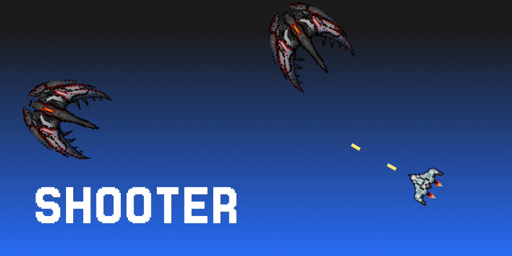
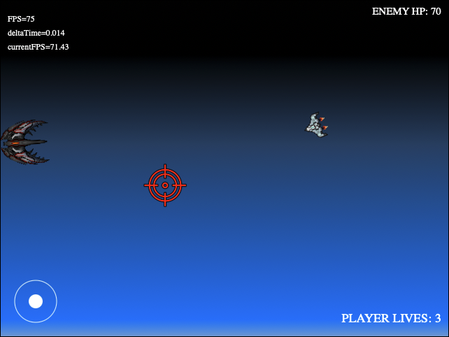
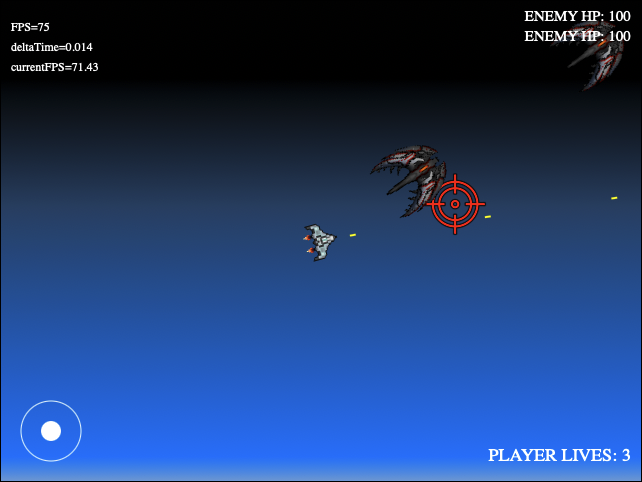

  

# Shooter Game

**Shooter Game** is a web based project that uses the HTML canvas to display a basic spaceship shooter game. 
The game allows the player to shoot enemies while avoiding crashing with them.

## Features

- **Movement** with the keyboard
- **Aiming and shooting** with the mouse
- Two kinds of **enemies**:
    - Ship that follows the player around trying to crash with the player 
    - Ship that aims for the player and shoots itself towards him every few seconds

## Screenshots

  
  

## Future Features

At the moment, there are no plans to introduce any new features.

## Requirements

This version of the game works on the browser but only on desktop, not mobile browsers.

## License

This project is licensed under the MIT License.

#

**Shooter Game** is an open-source project developed by Javier Iregui, 2022.